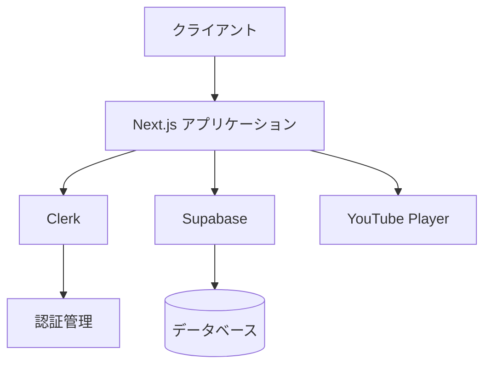
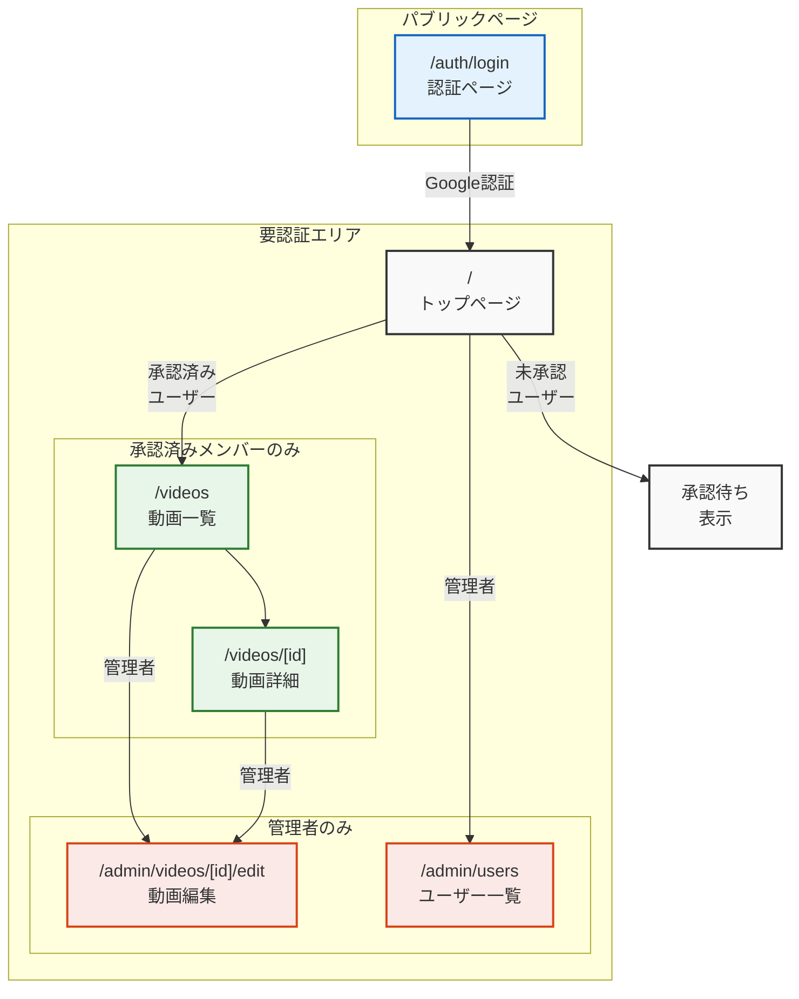

# 会員用ポータルサイト 企画書

## プロジェクト概要
### 目的
会員限定の動画コンテンツを提供するための安全で使いやすいポータルサイトを構築する。

### 主要機能
Google認証による会員管理と承認機能
動画コンテンツの閲覧機能

## システム構成
### 技術スタック
#### フロントエンド
* Next.js (TypeScript)
* Tailwind CSS
* Shadcn/ui

#### バックエンド/インフラ
* Clerk (認証)
* Supabase (データベース)
* Vercel (ホスティング)

#### 開発環境
* Github (ソースコード管理・CI/CD)

### システムアーキテクチャ

### 画面設計

## 機能要件
### 認証・認可機能
* ユーザー認証
    * Googleアカウントによるログイン
    * セッション管理
    * ログアウト
* 管理者承認機能
    * 新規会員の承認ワークフロー
    * 会員ステータス管理（承認待ち/承認済み/停止）
    * 管理者による会員情報の編集

### 動画コンテンツ機能
* 動画一覧表示
    * サムネイル表示
    * タイトル・説明文の表示
    * 一覧表示の最適化（ページネーション）
* 動画再生
    * YouTube埋め込みプレーヤー
    * 承認済み会員のみ視聴可能
* 管理者機能
    * 動画の登録・編集
    * 会員の承認管理

### 画面設計
https://bolt.new/~/bolt-nextjs-shadcn-uegdjkyk

## 開発スケジュール（全9週間）
### フェーズ0：立ち上げ（1週間）
メンバー募集・選定
キックオフミーティング
開発体制の確立

### フェーズ1：企画・設計（2週間）
機能要件定義、コンテンツ整理
UIデザイン作成、DB設計

### フェーズ2：環境構築（1週間）
GitHub/Vercel/Supabase環境構築
開発フロー確認

### フェーズ3：認証・UI実装（2週間）
Clerk認証、基本レイアウト
各画面のUI実装

### フェーズ4：機能実装（1週間）
DB連携（users/videos）
コンテンツ実装

### フェーズ5：テスト・修正（1週間）
動作検証・バグ修正
本番環境確認
※ 各フェーズ終了時にレビューを実施し、次フェーズの判断を行います。

## 今後の拡張性
* カテゴリーによる動画分類
* 視聴履歴機能
* 記事コンテンツ
* プログラミングアプリ
* コメント・いいね機能
* アクセス分析機能

